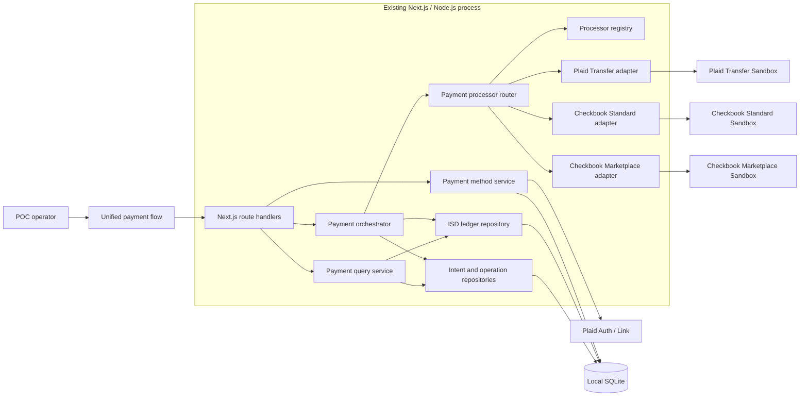

# Payment Processor Router POC — High-Level Design

Status: Draft for architecture and implementation planning · Last updated: 2026-07-29
Product requirements: [Payment Processor Router POC — Product Requirements](../product/payment-router-poc-requirements.md)

## 1. Purpose

Define a POC-scale architecture and delivery sequence for the unified payment
flow. The design provides enough structure to delegate implementation in
independently reviewable slices while preserving room for processor discovery.

This HLD is not a production target. It intentionally favors:

- clear contracts over framework breadth;
- a local TypeScript/Next.js/SQLite implementation over distributed services;
- explicit Sandbox processor selection over automated routing;
- truthful capability gaps over forced processor parity;
- reviewable vertical progress over a speculative complete platform.

## 2. POC boundary

### The POC will demonstrate

- one featured payment flow above the three existing provider experiments;
- Plaid Auth as the primary payment-method connection boundary;
- add, view, update/replace, and remove payment-method behavior;
- a processor registry, router, and common adapter contract;
- explicit operator selection of a processor;
- debit and credit payment composition;
- processor-specific primary funding profiles;
- actual Sandbox execution through at least two processor adapters;
- provider-confirmed Sandbox settlement;
- one normalized payment history backed by the existing ISD ledger.

### The POC will not become

- a production payment service;
- a microservice estate;
- an automatic least-cost, availability, or failover router;
- a universal abstraction that erases provider differences;
- a production secrets, authentication, compliance, fraud, or treasury system;
- a production-grade webhook ingestion platform;
- evidence that all processors support both directions or the same rails.

Sandbox containment, secret hygiene, idempotency, and ambiguous-outcome safety
remain required because the POC executes real provider Sandbox operations and
must produce trustworthy findings.

## 3. Existing baseline

The design builds on the current repository rather than replacing it:

- `payment-ui` owns the Next.js pages, flow UI, and route handlers.
- `payment-api` owns provider SDK/API integration and SQLite repositories.
- Plaid Auth persists Items and active payment methods.
- Plaid Transfer and Checkbook Standard create provider-neutral intents and
  provider-specific operations.
- Checkbook Marketplace provisions users, banks, wallets, and treasury state.
- `isd_ledger_entries` is the canonical entity ledger.
- The existing three flow pages remain available as diagnostic/reference paths.

Known baseline gaps that affect this design:

- no shared processor adapter contract or router;
- route handlers directly coordinate reservation and provider invocation;
- processor capabilities and funding models are implicit;
- ambiguous provider errors can be treated as safe rejection;
- status progression is driven by manual Sandbox completion;
- no automated test suite;
- repository `check` currently fails on one React lint error.

## 4. Architecture principles

1. **One deployable POC.** Keep the implementation in the existing monorepo and
   Next.js process.
2. **Server-side orchestration.** Browser code submits normalized commands and
   receives sanitized views; it never invokes processors directly.
3. **Static registration, dynamic readiness.** Adapter identities are
   registered in code. Their capability/readiness results may depend on
   environment configuration, payment method, direction, and provider state.
4. **Explicit dispatch.** The operator selects the adapter. The router validates
   and dispatches that selection; it does not optimize or silently fall back.
5. **One economic intent, one processor binding.** A persisted payment intent is
   bound to its selected processor before an external submission.
6. **Provider-neutral core, provider-specific evidence.** Common status and
   ledger behavior do not replace exact provider operations and statuses.
7. **Funding is part of routing.** An adapter is not ready unless it can explain
   and validate its direction-specific funding profile.
8. **Unsupported is a valid result.** Adapters may declare a direction, rail, or
   settlement operation unsupported with a specific reason.
9. **Ambiguity is durable.** Unknown submission outcomes remain assigned to the
   selected processor and require status synchronization or operator review.
10. **Incremental extraction.** Existing provider functions should be wrapped
    and reshaped incrementally; avoid rewriting working Sandbox integrations in
    the first slices.

## 5. Target system context



The boxes are logical responsibilities, not required deployment boundaries.
Several may remain modules within `payment-api`.

## 6. Logical components

### 6.1 Unified payment flow

Responsibilities:

- own the featured POC experience;
- maintain selected entity and draft payment context;
- invoke Plaid Auth payment-method management;
- show processor capability and funding-profile choices;
- collect direction, amount, method, rail, and consent;
- show route review before confirmation;
- display execution, settlement, and unified history.

The existing three flow components remain intact initially and may continue to
use their current APIs until the unified flow is proven.

### 6.2 Unified route handlers

Responsibilities:

- validate and parse browser requests;
- call one application service per operation;
- translate known domain errors into stable POC API responses;
- expose only sanitized provider and payment-method data.

Expected POC endpoints or equivalent route groups:

- `GET /api/payment-router/context`
- `GET /api/payment-router/processors`
- `POST /api/payment-router/payments`
- `GET /api/payment-router/payments`
- `GET /api/payment-router/payments/:id`
- `POST /api/payment-router/payments/:id/synchronize`
- existing Plaid payment-method endpoints, extended only where needed.

Exact route shapes remain a slice-level decision.

### 6.3 Payment method service

Responsibilities:

- create Plaid Link sessions;
- exchange public tokens and retain server-side access;
- list active methods for an entity;
- repair a Plaid Item through Update Mode when implemented;
- replace the selected account or Item;
- remove a method from active use without deleting history;
- provide masked account and known capability metadata to the router.

For early slices, "update" may be implemented as explicit replacement if the UI
and documentation distinguish it from Plaid Update Mode. Discovery will decide
whether Update Mode is required for POC completion.

### 6.4 Processor registry

Responsibilities:

- expose the configured adapter set;
- look up one adapter by stable processor ID;
- prevent duplicate adapter registration;
- distinguish registered, configured, ready, unavailable, and unsupported;
- aggregate adapter capabilities for UI presentation.

The POC registry should be a typed in-process registry assembled at startup. A
database-backed plugin system is out of scope.

### 6.5 Payment processor router

Responsibilities:

1. receive a normalized payment command;
2. resolve the explicitly selected adapter;
3. request current capabilities and funding profile;
4. reject unsupported or unready combinations before reservation;
5. create or recover the durable payment intent;
6. bind the intent to the selected processor;
7. coordinate reservation with the orchestrator;
8. invoke the adapter idempotently;
9. persist the normalized result and provider operation evidence;
10. return a sanitized payment view.

The router does not:

- rank adapters;
- choose an adapter for the user;
- retry through another adapter;
- own provider credentials;
- directly write arbitrary ledger entries.

### 6.6 Processor adapter

The adapter is the only shared abstraction over processors. It should remain
small enough that provider-specific behavior stays visible.

Conceptual contract:

```ts
interface PaymentProcessorAdapter {
  readonly id: ProcessorId;
  readonly displayName: string;

  describeCapabilities(
    context: ProcessorContext,
  ): Promise<ProcessorCapabilities>;

  describeFunding(
    request: FundingProfileRequest,
  ): Promise<FundingProfile>;

  validate(
    command: NormalizedPaymentCommand,
    context: ProcessorContext,
  ): Promise<ValidationResult>;

  submit(
    command: BoundPaymentCommand,
    context: ProcessorContext,
  ): Promise<SubmissionResult>;

  synchronize(
    operation: ProviderOperationReference,
    context: ProcessorContext,
  ): Promise<SynchronizationResult>;
}
```

The exact TypeScript types are defined in a delivery slice. Required semantic
rules are:

- `describeCapabilities` is side-effect free;
- `describeFunding` is side-effect free except for provider balance reads;
- `validate` performs no money movement;
- `submit` uses the persisted intent idempotency identity;
- `synchronize` may update provider state but does not mutate the ISD ledger
  directly;
- returned metadata is sanitized before persistence or browser exposure.

### 6.7 Payment orchestrator

Responsibilities:

- own the transaction boundary between payment intent and ledger reservation;
- invoke the router after durable binding;
- classify adapter results as rejected, accepted, processing, ambiguous, or
  terminal;
- settle or release ledger reservations only under explicit rules;
- synchronize submitted operations;
- make repeated submission and terminal processing idempotent.

The orchestrator should replace duplicated route-level coordination gradually.
Existing flows need not migrate until the unified flow is working.

### 6.8 Payment query service

Responsibilities:

- compose entity balances, payment intents, provider operations, and ledger
  entries into one read model;
- retain exact provider status alongside normalized status;
- expose payment-method and funding-account snapshots;
- support unified list and detail views.

This can remain synchronous SQLite querying in the POC.

### 6.9 Persistence

Continue using local SQLite and append-only ledger entries.

Existing tables to retain:

- `plaid_items`
- `payment_methods`
- `payment_intents`
- `provider_operations`
- `demo_cash_outs`
- `isd_ledger_entries`
- Marketplace participant, wallet, and treasury tables.

Likely schema evolution:

| Concern | Likely change |
| --- | --- |
| Explicit processor binding | Normalize/stabilize `provider_path` as the selected processor ID |
| Source and destination | Add structured or explicit references to the intent |
| Funding snapshot | Add a funding-profile snapshot or immutable funding reference |
| Consent | Preserve authorization text version, actor, and timestamp |
| Ambiguous outcome | Add or consistently use a normalized `action_required` state and reason |
| Router diagnostics | Retain sanitized validation/capability evidence where useful |
| Unified history | Add query indexes only when demonstrated necessary |

Migration details are deliberately deferred until the domain-contract slice
compares these needs with the existing schema. Avoid parallel ledger tables.

## 7. Core domain contracts

### 7.1 Normalized payment command

Minimum fields:

- demo entity and actor;
- movement type: `external_debit` or `external_credit`;
- amount minor and currency;
- source type/reference;
- destination type/reference;
- payment-method ID;
- selected processor ID;
- requested rail;
- funding-profile ID or resolved funding reference;
- debit authorization evidence when required;
- idempotency key.

### 7.2 Processor capabilities

Capabilities are contextual, not permanent marketing claims.

Minimum representation:

- processor identity and display name;
- supported movement types;
- supported/requestable rails;
- payment-method prerequisites;
- funding-model summary;
- execution availability;
- synchronization/settlement availability;
- readiness state;
- one or more blocking reasons;
- evidence timestamp.

### 7.3 Funding profile

Minimum representation:

- processor and direction;
- funding account type;
- owner and custodian;
- masked/provider reference;
- role: source, destination, or intermediary;
- prefunding requirement;
- known balance/capacity;
- readiness and blocking reason;
- provider-specific explanatory text;
- snapshot timestamp.

The profile explains processor behavior. It does not imply one physical funding
account can be shared across processors.

### 7.4 Adapter results

Adapter submission results must distinguish:

| Result | Meaning | Ledger action |
| --- | --- | --- |
| `rejected` | Provider definitively did not accept movement | Release reservation |
| `accepted` | Provider accepted and returned an external ID | Keep reserved |
| `processing` | Provider reports in-flight state | Keep reserved |
| `ambiguous` | Acceptance cannot be safely determined | Keep reserved; require synchronization |
| `settled` | Provider-specific POC settlement rule confirmed | Move reserved to paid/received result |
| `failed` | Known terminal failure without movement | Release under adapter-specific rule |
| `returned` | Previously moved/settled funds reversed | Post explicit return entries |

The adapter reports provider facts. The orchestrator owns normalized status and
ledger consequences.

## 8. Principal request flows

### 8.1 Capability discovery

1. UI selects an entity, payment method, and direction.
2. API requests capability descriptions from registered adapters.
3. Each adapter evaluates local configuration, payment-method compatibility,
   direction, rail, and funding readiness.
4. API returns all configured adapters with readiness or blocking reasons.
5. UI allows selection only when the route is supported and ready.

Capability reads must not create provider users, wallets, authorizations, or
payments.

### 8.2 Payment submission

1. UI submits the reviewed normalized command and idempotency key.
2. Orchestrator validates entity, method, amount, direction, processor, and
   funding profile.
3. A database transaction creates/reuses the intent, binds the processor, and
   reserves ledger funds where the direction requires reservation.
4. Router calls the selected adapter.
5. Adapter returns a classified result plus sanitized provider evidence.
6. Orchestrator persists operations and normalized state.
7. A definitive rejection releases the reservation transactionally.
8. Accepted, processing, or ambiguous results remain reserved.

The exact ledger treatment of inbound debit proceeds is a discovery item. The
first slice implementing debit must document whether it creates pending,
reserved, or available entitlement and why.

### 8.3 Status synchronization and settlement

1. UI or POC control requests synchronization for one payment.
2. Orchestrator loads the bound processor operation.
3. Router calls that adapter's `synchronize`.
4. Adapter retrieves or simulates provider status and returns a classified
   result.
5. Orchestrator idempotently updates operation and normalized intent status.
6. Terminal results post the required ledger entries in the same database
   transaction.

The POC may use explicit Sandbox simulation controls. They must be separate from
ordinary status refresh in the UI and code path where the provider requires a
mutation to simulate settlement.

### 8.4 Payment-method removal

1. UI requests removal for the selected entity.
2. Payment method service verifies entity ownership and active status.
3. Method becomes inactive for future payment commands.
4. Existing intent, operation, and ledger snapshots remain unchanged.
5. Capability discovery recomputes available routes.

## 9. Error and safety model

### Pre-submission errors

Examples:

- invalid amount;
- inactive payment method;
- unsupported direction or rail;
- missing processor configuration;
- funding account not ready;
- insufficient known funding capacity.

These fail before provider invocation and may safely avoid or release a
reservation.

### Definitive provider rejection

The adapter must have positive evidence that the provider did not accept the
payment. The orchestrator records the rejection and applies the documented
release rule.

### Ambiguous submission

Examples:

- network timeout;
- connection reset;
- malformed response after request transmission;
- provider returned an unknown response without a reliable rejection.

The intent remains bound to the adapter with its reservation intact. A repeated
command reuses the same idempotency identity or synchronizes status; it never
changes processors automatically.

### Unexpected internal failure

If an internal failure occurs after durable intent creation, the payment remains
recoverable from persisted state. The POC must not infer that an unrecorded
provider response means rejection.

## 10. Processor discovery strategy

Processor discovery is expected throughout implementation. Discovery should be
captured as bounded evidence, not allowed to destabilize shared contracts.

Each processor phase begins with a discovery slice that records:

- supported Sandbox directions and rails;
- payment-method requirements;
- primary funding account mechanics;
- setup/provisioning requirements;
- provider idempotency behavior;
- submission response and exact statuses;
- status retrieval or simulation mechanism;
- terminal success, failure, cancellation, and return semantics;
- known gaps and adapter capabilities that must remain unsupported.

Discovery outcomes may:

- activate a capability;
- keep it explicitly unsupported;
- revise a processor-specific mapping;
- propose a shared contract change.

A shared contract change requires a focused architecture review and regression
against adapters already accepted. Do not broaden the contract solely to hide
one provider's unique behavior.

## 11. Delivery phases and slices

Each slice is intended to be delegated as one implementation task with a narrow
review surface. Slice IDs express dependency order, not an instruction to start
all work immediately.

### Phase 0 — Establish a reliable baseline

Goal: make current behavior reproducible and protect existing POC evidence
before introducing the router.

| Slice | Deliverable | Depends on | Acceptance boundary |
| --- | --- | --- | --- |
| P0-S1 | Baseline inventory and executable test scaffolding | None | Current migrations and core ledger/payment repositories can run against an isolated temporary SQLite database; existing local data is untouched |
| P0-S2 | Quality-gate repair | P0-S1 | `npm run check`, `npm run build`, and the initial test command pass |
| P0-S3 | Existing-flow characterization tests | P0-S1 | Tests capture current Plaid Transfer reservation/settlement and Checkbook Standard reservation/settlement behavior without refactoring providers |

Phase gate:

- clean build/check;
- isolated tests do not use the operator's existing SQLite database;
- current provider flows remain behaviorally unchanged.

### Phase 1 — Define the normalized core

Goal: create the smallest shared language needed by the router.

| Slice | Deliverable | Depends on | Acceptance boundary |
| --- | --- | --- | --- |
| P1-S1 | Normalized command, capability, funding-profile, and result types | P0 | Type-level contracts cover debit, credit, readiness, funding roles, and ambiguous outcomes; no provider integration changes |
| P1-S2 | Processor registry with a deterministic fake adapter | P1-S1 | Registry lists configured/unavailable adapters and rejects duplicate/unknown IDs; fake adapter supports controlled test scenarios |
| P1-S3 | Schema reconciliation and migrations | P1-S1 | Existing schema is mapped to the contracts; only demonstrated missing fields are added; forward migration preserves existing POC data |
| P1-S4 | Unified payment query model | P1-S3 | One server-side query returns entity balances, normalized payments, provider operations, and ledger trace without exposing secrets |

Phase gate:

- contracts are provider-neutral but do not claim false parity;
- migrations work from a fresh database and a copy representing the current
  schema;
- fake adapter proves success, rejection, processing, ambiguity, and settlement
  result shapes.

### Phase 2 — Implement routing and orchestration

Goal: prove the router and ledger lifecycle without depending on unresolved
provider behavior.

| Slice | Deliverable | Depends on | Acceptance boundary |
| --- | --- | --- | --- |
| P2-S1 | Capability and funding discovery service | P1-S2 | Side-effect-free aggregation returns readiness and blocking reasons for all registered adapters |
| P2-S2 | Explicit processor router | P2-S1 | Router validates the selected adapter and dispatches only to that adapter; no ranking or fallback exists |
| P2-S3 | Durable payment orchestration | P1-S3, P2-S2 | Intent creation, processor binding, reservation, operation persistence, and adapter result classification are idempotent |
| P2-S4 | Synchronization and terminal ledger processing | P2-S3 | Repeated synchronization settles/releases once; ambiguous results keep reservations and processor binding |
| P2-S5 | Router failure matrix | P2-S4 | Automated tests cover rejection, timeout-after-send, replay, crash/restart recovery, settlement replay, and attempted processor conflict |

Phase gate:

- the fake adapter executes complete debit/credit lifecycle scenarios;
- no ambiguous result releases funds;
- a persisted intent cannot be rebound to another processor.

### Phase 3 — Build the featured flow shell

Goal: expose the shared product model before introducing more processor-specific
behavior.

| Slice | Deliverable | Depends on | Acceptance boundary |
| --- | --- | --- | --- |
| P3-S1 | Main-page hierarchy | P0-S2 | New unified flow is featured above the existing three flows; all existing pages remain reachable |
| P3-S2 | Unified flow context and payment-method panel | P1-S4 | Entity selection, balances, active method, add, replace/remove, and method history behavior are visible |
| P3-S3 | Payment composer and processor comparison | P2-S1 | Direction, amount, method, rail, adapter readiness, funding profile, and unavailable reasons are presented |
| P3-S4 | Review, execute, synchronize, and history views | P2-S4, P3-S3 | Fake-adapter lifecycle is operable end-to-end from the UI with route review and ledger trace |

Phase gate:

- the featured flow works end-to-end with the deterministic adapter;
- changing entity or method invalidates unsafe draft state;
- the UI differentiates POC simulation, provider acceptance, processing, and
  settlement.

### Phase 4 — Plaid Transfer adapter

Goal: make Plaid Transfer the first real adapter and demonstrate both directions
where Sandbox and linked-account capabilities allow.

| Slice | Deliverable | Depends on | Acceptance boundary |
| --- | --- | --- | --- |
| P4-S1 | Plaid Transfer discovery record | P1-S1 | Direction, ACH class, Ledger role, consent, idempotency, capability, and Sandbox status findings are documented with supported/unsupported decisions |
| P4-S2 | Plaid capability and funding profile | P4-S1, P2-S1 | Adapter reports linked-account direction support and explicit Plaid Ledger readiness/capacity without side effects |
| P4-S3 | Plaid credit submission adapter | P4-S2, P2-S3 | Existing ACH credit behavior executes through the router and retains authorization/transfer evidence |
| P4-S4 | Plaid debit submission and consent | P4-S2, P2-S3 | ACH debit executes through the router with captured consent evidence and documented inbound-ledger treatment |
| P4-S5 | Plaid synchronization and Sandbox settlement | P4-S3, P4-S4, P2-S4 | Pending/posted/settled progression is provider-confirmed and terminal ledger posting is idempotent |
| P4-S6 | Plaid end-to-end acceptance | P4-S5, P3-S4 | UI demonstrates supported debit and credit routes, ambiguity handling, history, and ledger trace |

Discovery exit options:

- unsupported account directions remain visible with a reason;
- RTP remains out of scope unless separately activated;
- findings may refine the Plaid adapter without requiring other adapters to
  mirror Plaid Ledger semantics.

Phase gate:

- at least one provider-confirmed Plaid Sandbox payment settles through the
  router;
- debit and credit are each either demonstrated or explicitly capability-gated
  with evidence;
- legacy Plaid flow remains usable for comparison.

### Phase 5 — Checkbook Standard adapter

Goal: provide a second real adapter and establish how a materially different
recipient/funding model fits the router.

| Slice | Deliverable | Depends on | Acceptance boundary |
| --- | --- | --- | --- |
| P5-S1 | Checkbook Standard discovery record | P1-S1 | Verified bank/wallet funding, credit behavior, possible debit/invoice behavior, recipient UX, idempotency, and terminal statuses are documented |
| P5-S2 | Standard capability and funding profile | P5-S1, P2-S1 | Adapter exposes the configured sender and verified funding source; unsupported directions have explicit reasons |
| P5-S3 | Standard credit submission adapter | P5-S2, P2-S3 | Existing digital-payment behavior executes through the router without treating the user's Plaid method as the sender's funding bank |
| P5-S4 | Standard synchronization and Sandbox settlement | P5-S3, P2-S4 | Exact Checkbook status is retained and provider-confirmed `PAID` posts one terminal ledger result |
| P5-S5 | Debit/collection decision slice | P5-S1 | Either a separately named invoice/collection debit is demonstrated or Standard debit is formally left unsupported in the POC |
| P5-S6 | Standard end-to-end acceptance | P5-S4, P5-S5, P3-S4 | UI executes supported routes, explains recipient handoff and funding, and preserves unified history |

Phase gate:

- the same router contract has executed both Plaid Transfer and Checkbook
  Standard Sandbox payments;
- Standard-specific recipient and funding behavior remains visible;
- unsupported debit does not block POC completion if debit is demonstrated by
  another accepted adapter.

### Phase 6 — Checkbook Marketplace adapter decision

Goal: decide whether Marketplace adds necessary POC evidence or remains a
supporting experiment.

This phase is conditionally required. It becomes an implementation phase only
if product discovery confirms that provider-hosted wallets are part of the
router POC question.

| Slice | Deliverable | Depends on | Acceptance boundary |
| --- | --- | --- | --- |
| P6-S1 | Marketplace fit and funds-flow discovery | P1-S1, P5 | Treasury, participant wallet, internal manifestation, external debit/credit, credential, and settlement semantics are documented |
| P6-S2 | Architecture decision | P6-S1 | Decision records include Marketplace as a router adapter, keeps it as a separate experiment, or narrows it to a funding-profile demonstration |
| P6-S3 | Marketplace capability/funding adapter | P6-S2=include | Treasury and participant-wallet roles are reported without provisioning side effects |
| P6-S4 | Selected Marketplace movement | P6-S3, P2-S4 | One explicitly approved internal or external movement runs through the router and reconciles with the canonical ledger |
| P6-S5 | Marketplace end-to-end acceptance | P6-S4, P3-S4 | UI explains wallet/funding asymmetry and shows provider and ledger evidence |

Phase gate:

- no Marketplace code is forced into the router solely for adapter count;
- if included, wallet balances remain provider manifestations rather than a
  second entitlement ledger.

### Phase 7 — POC completion and evidence

Goal: close the POC with repeatable evidence, documented gaps, and a clean
handoff to any later design/architecture decision.

| Slice | Deliverable | Depends on | Acceptance boundary |
| --- | --- | --- | --- |
| P7-S1 | Cross-adapter capability and funding review | P4, P5, optional P6 | UI and documentation agree on supported directions, rails, funding profiles, and settlement semantics |
| P7-S2 | End-to-end acceptance matrix | P4, P5 | At least two adapters execute through the router; the POC as a whole demonstrates one debit and one credit |
| P7-S3 | Failure and recovery evidence | P2-S5, real adapters | Definitive rejection, ambiguity, retry, restart, repeated settlement, and unsupported routes are demonstrated without duplicate ledger impact |
| P7-S4 | Documentation reconciliation | P7-S1–S3 | PRD, HLD, working plan, README, and actual UI state use consistent POC language and identify unresolved discovery |
| P7-S5 | POC closeout checkpoint | P7-S4 | Stakeholders explicitly accept findings, gaps, and whether any production-oriented architecture work should begin |

Phase gate:

- product completion criteria are evidenced;
- no production-readiness claim is inferred;
- deferred capabilities remain explicit;
- production design, if desired, starts as a separate authorized effort.

## 12. Delegation and review model

### Slice task contract

Each delegated implementation task should include:

- slice ID and goal;
- exact files or logical components in scope;
- prerequisites and accepted prior-slice contracts;
- required tests and commands;
- acceptance evidence;
- known discovery questions;
- explicit non-goals;
- stop boundary after review readiness.

### Review expectations

Every slice should be independently reviewable and should:

- preserve existing uncommitted/user-owned work;
- avoid unrelated formatting or refactoring;
- include schema rollback/recovery notes when migrations change;
- use isolated temporary databases for automated tests;
- report provider evidence without storing secrets;
- end with one of:
  - `review-ready`;
  - `discovery-blocked` with evidence and a narrowed next question;
  - `remediation-ready` after review findings.

### Parallel work lanes

After Phase 1 contracts are accepted, limited parallelism is possible:

- featured UI hierarchy can proceed against fake query data;
- processor discovery can proceed independently for Plaid and Checkbook;
- query/history work can proceed against normalized fixtures;
- test-matrix construction can proceed against the fake adapter.

Do not parallelize:

- competing versions of the shared adapter contract;
- overlapping schema migrations;
- multiple implementations of orchestration transaction boundaries;
- provider adapter work before its discovery record defines supported behavior.

## 13. Required architecture decisions

The following decisions are required before or during the named slices:

| Decision | Required by |
| --- | --- |
| Stable processor IDs and adapter contract | P1-S1 |
| Intent/operation/ledger transaction boundary | P2-S3 |
| Ambiguous result classification and recovery | P2-S3 |
| Funding-profile snapshot persistence | P1-S3 |
| Payment-method update vs replacement scope | P3-S2 |
| Plaid inbound debit ledger treatment | P4-S4 |
| Plaid settlement rule | P4-S5 |
| Checkbook Standard primary funding account | P5-S2 |
| Checkbook Standard debit fit | P5-S5 |
| Marketplace inclusion in unified router | P6-S2 |

Decisions should be recorded in this document or a nearby decision record and
linked from the affected slice. Processor-specific decisions should not be
promoted to shared invariants without cross-adapter evidence.

## 14. POC verification strategy

### Automated

- contract and registry unit tests;
- adapter conformance tests using deterministic fixtures;
- orchestrator transaction and idempotency tests;
- isolated SQLite migration tests;
- route validation tests;
- lifecycle and ledger invariant tests;
- UI component or end-to-end tests for the featured flow;
- real adapter tests gated by explicit Sandbox credentials.

### Manual Sandbox evidence

- configured funding account and masked reference;
- capability/readiness response;
- reviewed source, processor, and destination;
- provider request/transaction identifiers;
- exact status progression;
- terminal provider confirmation;
- corresponding intent, operation, and ledger entries;
- replay result demonstrating idempotency.

### Required commands

The final command set should converge on:

```sh
npm run check
npm test
npm run build
```

Provider-backed tests should remain separate and opt-in so ordinary validation
does not move Sandbox funds or depend on provider availability.

## 15. Risks and containment

| Risk | POC containment |
| --- | --- |
| Abstraction hides provider differences | Capability and funding profiles; unsupported is explicit |
| Duplicate economic payment after timeout | Durable processor binding, stable idempotency, ambiguous state |
| Ledger diverges from provider | Provider synchronization plus atomic terminal posting |
| Discovery changes the contract repeatedly | Fake-adapter contract first; focused architecture review for shared changes |
| Marketplace expands scope | Conditional Phase 6 decision gate |
| Existing experiments regress | Characterization tests and incremental adapter wrapping |
| POC is mistaken for production architecture | Persistent Sandbox labeling, explicit non-goals, separate closeout decision |
| Provider tests become unreliable CI dependencies | Opt-in provider suite; deterministic default suite |

## 16. POC target exit

The HLD is satisfied when the repository contains:

- a featured unified payment flow;
- a small typed processor registry and router;
- normalized command, capability, funding, and result contracts;
- durable orchestration with safe ambiguity handling;
- at least two real Sandbox adapters;
- POC-wide debit and credit evidence;
- provider-confirmed settlement and unified ledger history;
- repeatable automated and manual evidence;
- explicit unsupported capabilities and unresolved discovery;
- no assertion that the result is a production payment platform.
